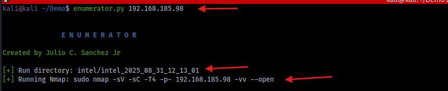
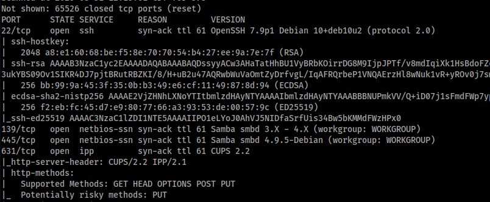
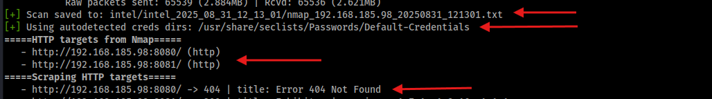
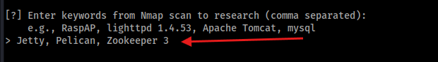
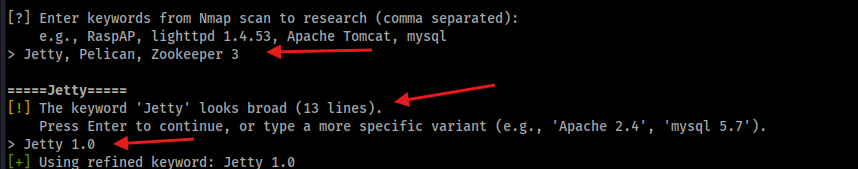
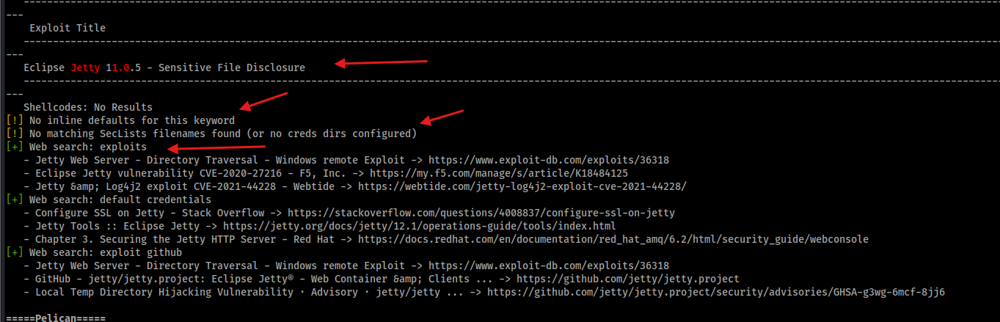

# Enumerator

**Enumerator** is a Python tool for automating reconnaissance and foothold research during penetration testing and OSCP/CPTS/PNPT-style labs.  

It runs Nmap, scrapes **HTTP/HTTPS** services automatically, and lets you input additional service keywords for deeper research (e.g., MySQL, Tomcat, RaspAP).  Then it helps you quickly research vulnerabilities, exploits, and default credentials. All findings are saved into a clean, timestamped `intel_*` folder with a Markdown report that you can use for documentation.

### Workflow **without** Enumerator
- Run Nmap
- Scan the output for services or keywords you think might be a service
- Add those keywords to your notes
- Start running those keywords through SearchSploit
- Add the output from SearchSploit to your notes
- Run a web search looking for exploits on the service
- Run a web search for default credentials
- Run a web search for exploits on Github
- Check if SecList has a file of credentials for that service
- For **HTTP**, check for `/admin`, `/robots.txt`, ...etc

### Workflow **WITH** Enumerator
- Run the program
- Enter your keywords
- Review the .md file that did everything above for you.

### Reviewing data
- Enumerator outputs everything right to the terminal so you can get a quick look
- Everything is saved to an `.md` file for more detailed review
- I like to use `batcat` to open the `.md` file.  It makes it look really nice.

---
# Demo
**Run Enumerator**
- You can see the basic command
- It shows you where it's saving the intel
- It shows you the Nmap command it's using
  


**Nmap runs**
- Nmap will run as you would normally expect it to



**HTTP Scraping for versions**
- Enumerator will identify HTTP ports
- It will then try identify text that looks like version identifiers
- The purpose is to help identify possible service versions that might be hard to spot



**Enter service keywords**
- Review your Nmap results
- Enter the keywords from Nmap you want to research further
- In this screenshot I entered Jetty, Pelican and Zookeeper 3



**Refine keywords if too many results possible**
- I entered `Jetty` as a keyword which may return to many results
- Enumerator will ask me to confirm by clicking enter or I can filter by adding something like `Jetty 1.0`



**Results**
- If a searchsploit result is found, it will be displayed
- If you passed a service name with common default credentials, they will be displayed (this list is hard coded and can be viwed in the script)
- If you passed a service name that matches with the title of a SecList .txt file, the name will be displayed for you to review and test



Web Results
- Enumerator will run three DuckDuckgo searches for each service keyword you pass.  For example, if  you pass in Jetty
  - It will search for `Jetty exploits` and return the top 3 results
  - It will search for `Jetty default credentials` and return the top 3 results
  - It will search for `Jetty exploits github` and return the top 3 results
 
---

## ✨ Features

- **Per-run intel folders** → results are neatly organized by timestamp.  
- **Nmap integration** → run scans directly from the tool (`-sV -sC -p-` by default).  
- **Keyword research**:
  - Runs `searchsploit` on user-provided keywords.
  - Lists **inline default creds** for common services (MySQL, Tomcat, RaspAP, etc).
  - Finds relevant **SecLists Default-Credentials** files for review.  
- **DuckDuckGo web searches**:
  - Runs 3 queries per keyword:
    - `<keyword> exploits`  
    - `<keyword> default credentials`  
    - `<keyword> exploit github`  
  - Cleans URLs and shows top 3 results with clickable links in the report.  
- **HTTP scraper**:
  - Detects service headers, titles, version hints.
  - Notes `/login`, `/admin`, `robots.txt`, `sitemap.xml`.  
  - Detects **Basic Auth** → generates ffuf & wfuzz brute-force templates.  
  - Detects **POST forms** → generates Hydra + curl templates.  
- **CeWL integration (optional)**:
  - Automatically builds site-specific wordlists.
  - Generates lowercase/unique versions with shell one-liners.  
- **Markdown report** with all commands used (great for OSCP documentation).  
- **Color-coded console output** for readability.  

---

## 🚀 Installation

Clone the repo:

```bash
git clone https://github.com/yourname/enumerator.git
cd enumerator
```

### Install dependencies
These dependencies may already exist on your Kali machine, so you may not need to install anything.  I just wanted to add it to ensure you have what you need. 
```bash
pip install -r requirements.txt
```

If you prefer to use virtual environments in Python
```bash
python3 -m venv venv
source venv/bin/activate
pip install -r requirements.txt
```

**Requirements**

System tools:
- nmap, searchsploit, wfuzz, ffuf, hydra, curl
- Optional: cewl (for site-specific wordlists), python3-bs4 (for HTML form parsing)

Python libs:
- `requests`
- `beautifulsoup4` (optional, for form parsing)

---
## Usage
### Basic Scan
```bash
python3 enumerator.py 10.10.10.5
```
- Runs the default Nmap scan (```sudo nmap -sV -sC -T4 -p- {target} -vv --open```)
- Then asks you to enter keywords from the Nmap output.

**Custom Nmap Scan**
```bash
python3 enumerator.py <target IP> --nmap "sudo nmap -Pn -p80 {target}"
```
- Yes, you litterally type `{target}`, so that it grabs the IP/hostname you entered to run the program. 

**SecList**
- Enumerator will use `/usr/share/seclists/Passwords/Default-Credentials` to check if the service keyword you passed in exists in the title to a SecList file and recommend it as a file to check for more credentials.

- If you have SecList saved in a different path, or you have another folder with default credentials, you can tell Enumerator to use that path instead of the default
```bash
--creds-dirs /path/to/your/folder
```
**NOTE** It is not attempting any sort of brute-force - it is simply suggesting a file for you to consider using

**Example**
- You pass in `mysql` as a keyword
- Enumerator will suggest `mysql-betterdefaultpasslist.txt` from SecList.

**CeWL**
```bash
python3 enumerator.py 10.10.10.5 --cewl --cewl-depth 2 --cewl-minlen 5
```
- This will scrape an HTTP target and build a wordlist you can use as possible passwords

## Output
The `.md` file is the best way to review all the output.  It's a bit cleaner and if you use something like `batcat` (a cat alternative) it looks really good.

All artifacts for a run are stored in a new folder, e.g.:
- When ran for the first time, an `intel` folder will be created for you
- Each additional time Enumerator is ran it will add a new timestamped folder inside `intel` for you to review
- A path to your newest scan will be displayed at the bottom so you can get to it quickly
```bash
intel_2025_08_31_203755/
├── nmap_10.10.10.5_20250831_203755.txt
├── report_10.10.10.5_20250831_203755.md
├── wordlists/ (if CeWL used)
```
---


